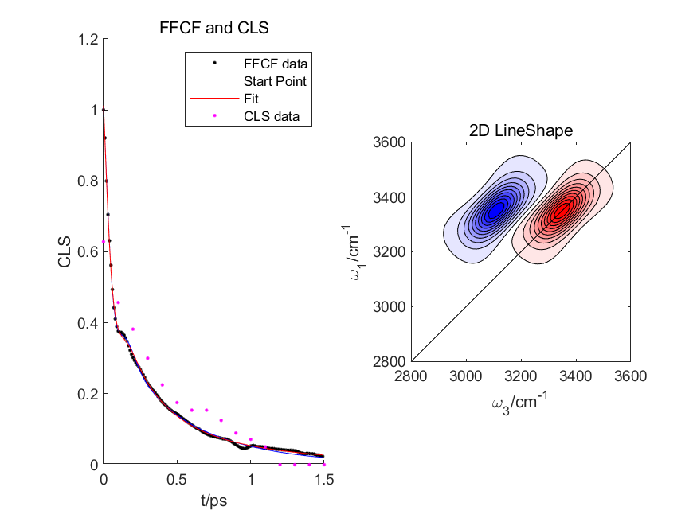

## Water 2DIR Simulation

Water 2DIR simulation (with cumulant truncation). This is a modification from the code in http://www.2d-ir-spectroscopy.com/ComputerCodes.html.

Example: 

```matlab
obj = water_2dir_simu('force.xvg', 'coord.xvg', figure(), 't2s', 0:.1:1.5)
```


